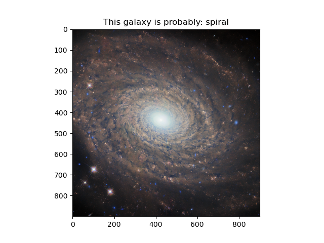
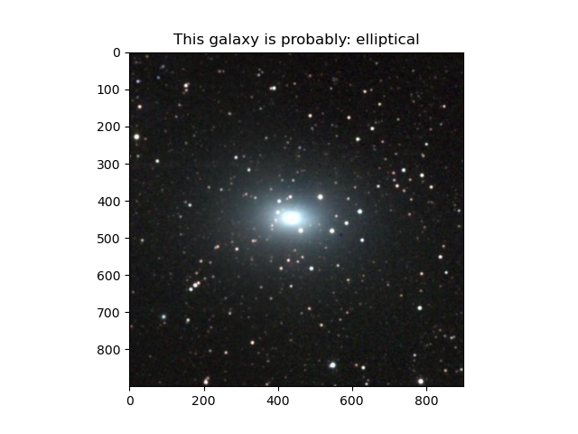
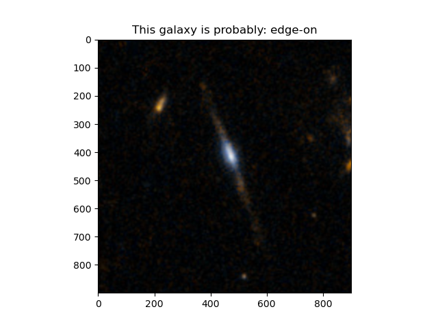
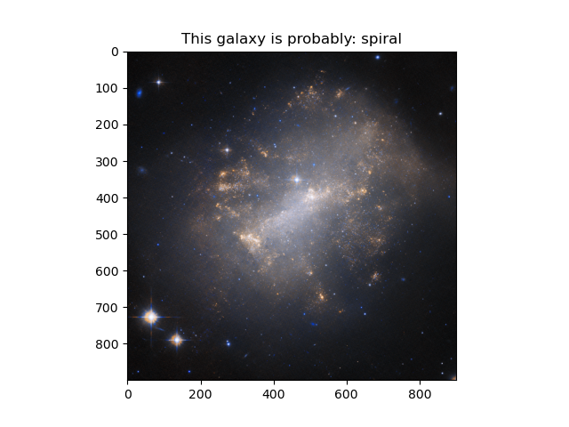

# A Basic ML model that classifies different Galaxies in space!

 this project was inspired from the <a href="https://www.zooniverse.org/projects/zookeeper/galaxy-zoo/">Galaxy Zoo</a> project by Zooniverse which is project running since many years and aims to classify Galaxies for Citizen science To understand how
 galaxies formed we need your help to classify them according to their shapes. If you're quick, you may even be the first person to see the galaxies you're asked to classify.

 

 There are different types of Galaxies in space. The most common are Spiral, elliptical, irregular, additionally based on how we see galaxies from earth, They may be Face-On or Edge-On. Face-on galaxies are galaxies which show features very clearly,
 In this case we are mostly talking about spiral or lenticular Galaxies (which is yet another type of galaxy out there). Edge on galaxy don't show much features except for the Central bulge and dustlane, These are mostly disc shaped galaxies. 
 trained with around 300 images of different types of galaxy's from NASA's (<a href="https://esahubble.org/images/archive/category/galaxies/">Galaxy archive </a>). Uses SVM (Support Vector Machine) for classification which is a supervised Learning 
 technique. You can test the model by downloading any image of a galaxy and make sure to compress the image to 900x900 pixel and put the image in test folder. This model fails to classify certain irregular galaxies as shown per the test.

<h1>Test results</h1>

  
test one (passed ✅)

  
  
test two (passed ✅)

  
  
test three (passed ✅)

  
  
test four (failed case  ❌)

  

